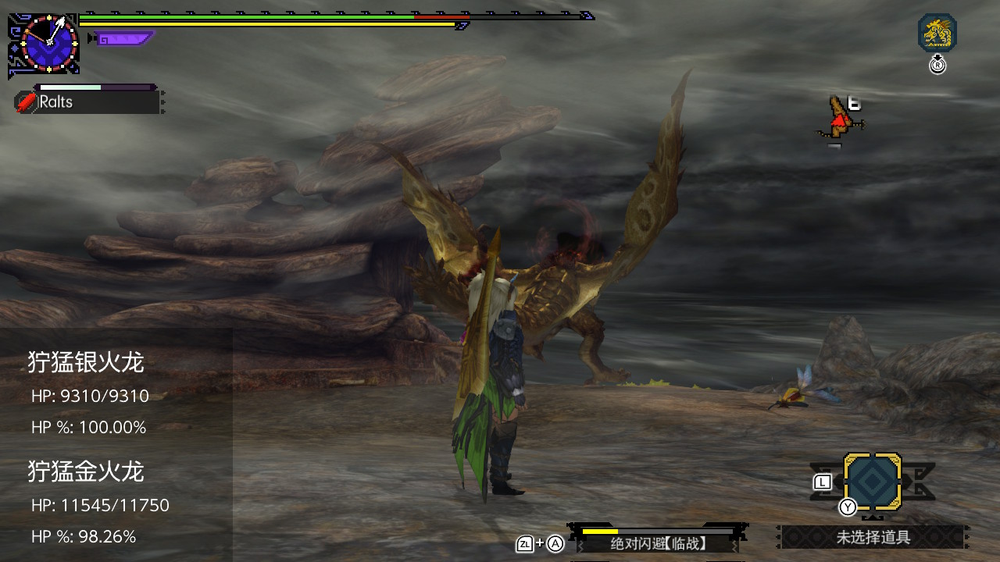
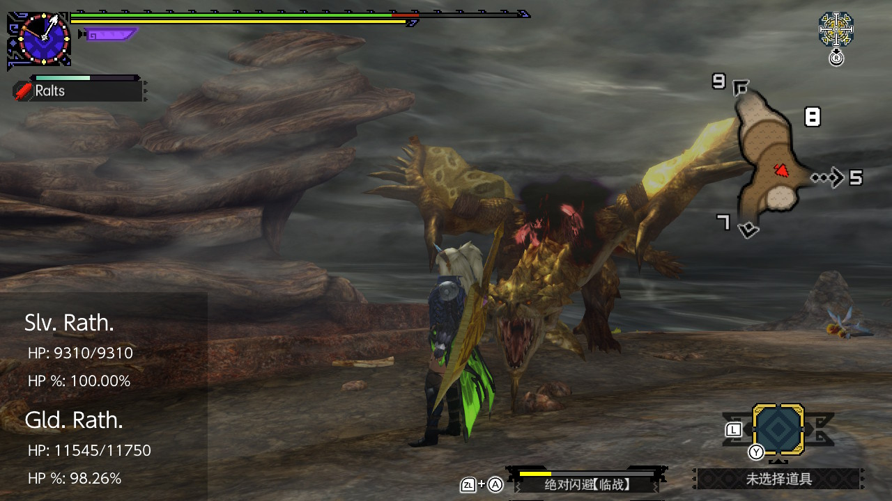

# MHGU-Monster-Info-Overlay
Display large monsters' HP info in real time.

This is an overlay homebrew dedicated to Nintendo Switch.
You need to have installed Tesla environment to use it.

You can exit from info page by pressing and holding Left Stick + Right Stick. To exit from main menu press B.

# ScreenShots
### Chinese

### English

# Requirements:
- Tesla Menu >=1.0.2
- MHGU ver 1.4.0

# Thanks to:
- masagrator for learning code from [masagrator/Status-Monitor-Overlay](https://github.com/masagrator/Status-Monitor-Overlay)
- Setsu-BHMT for finding monsters' data from [Setsu-BHMT/MHXX-Monster-Info-NTR-Plugin](https://github.com/Setsu-BHMT/MHXX-Monster-Info-NTR-Plugin)
- Kiranico's MHXX database [mhxx.kiranico.com](https://mhxx.kiranico.com/)
